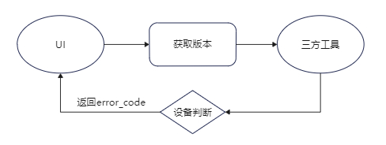
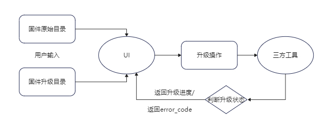

# 3308麦克风升级插件

## 一、功能实现

1. 调用第三方exe程序，能够获取3308麦克风的版本并显示。
2. 调用第三方exe程序，能够对3308麦克风进行升级，显示升级进度和升级结果。

## 二、主要逻辑

### 2.1版本获取

### 2.2升级操作

### 2.3 error_code

| 名称       | 状态码 | 描述           |
| ---------- | ------ | -------------- |
| ERR_OK     | 0      | 正确返回       |
| ERR_DEV    | 1      | 找不到设备文件 |
| ERR_VISION | 2      | 版本号解析错误 |
| ERR_TOOL   | 3      | 找不到三方工具 |
| ERR_INPUT  | 4      | 固件路径错误   |

